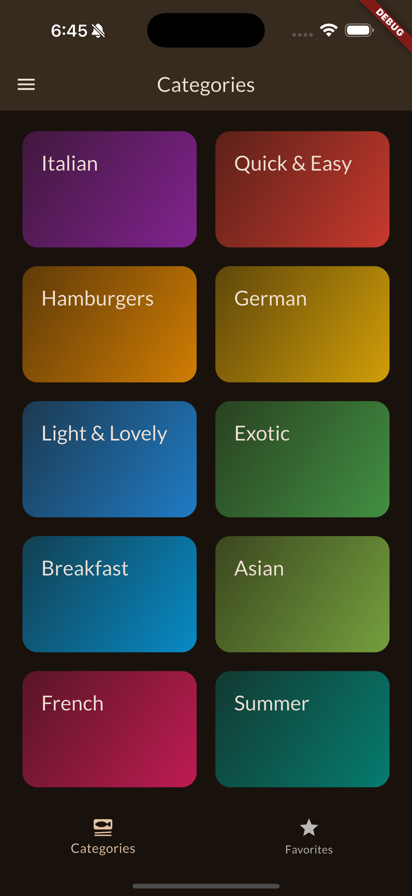
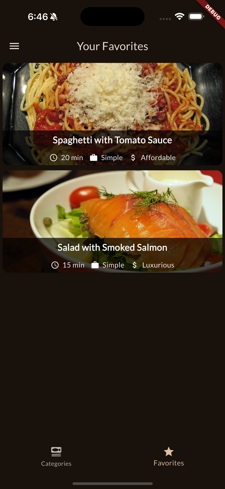
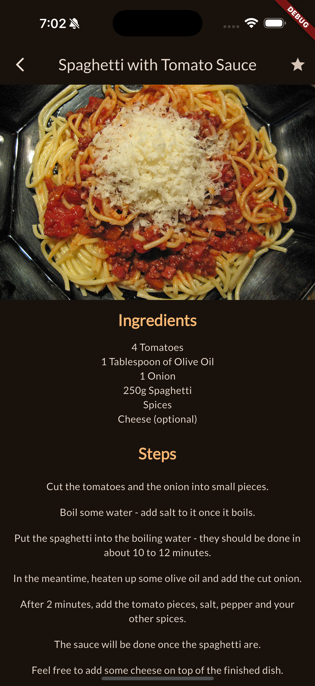
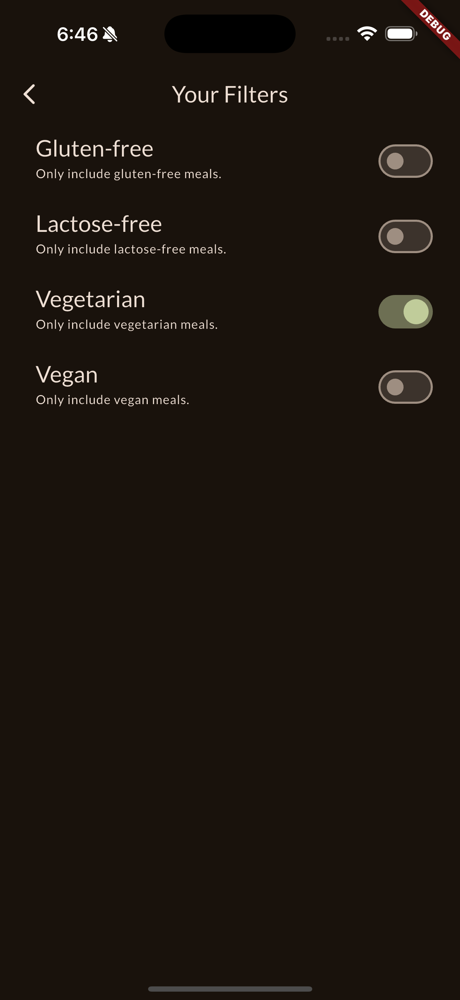

# 🍽️ Meals App (Flutter)

A simple yet powerful Flutter app to browse meals by category, filter them based on dietary preferences, and mark your favorite dishes.

## 📱 Preview

| Categories Screen | Meal Detail Screen | Filters Drawer |
|-------------------|--------------------|----------------|
|  |  |  |  |  |

## 🚀 Features

- Browse meals by **category**
- View full **meal details**
- Mark and view **favorite meals**
- Apply **filters**:
  - ✅ Gluten-Free  
  - ✅ Lactose-Free  
  - ✅ Vegetarian  
  - ✅ Vegan  
- Smooth navigation with:
  - **Tab Navigation**
  - **Side Drawer**
- **State Management** using [Riverpod](https://riverpod.dev)

## 🛠️ What I Learned

- Flutter **navigation & routing**
- Using **Drawer** for filters
- Creating **tabbed views**
- Managing app-wide **state with Riverpod**
- Structuring a Flutter app with clean and modular architecture

## 📦 Download APK

Want to try the app without building it?

👉 [Download the APK](https://github.com/YOUR_USERNAME/YOUR_REPO/releases/download/v1.0.0/app-release.apk)
